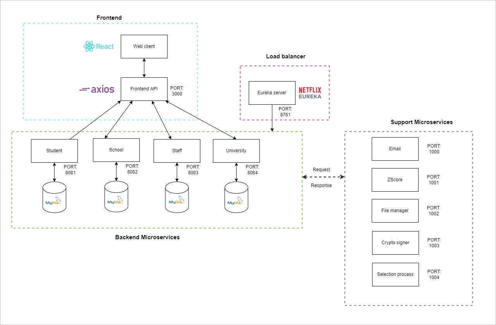
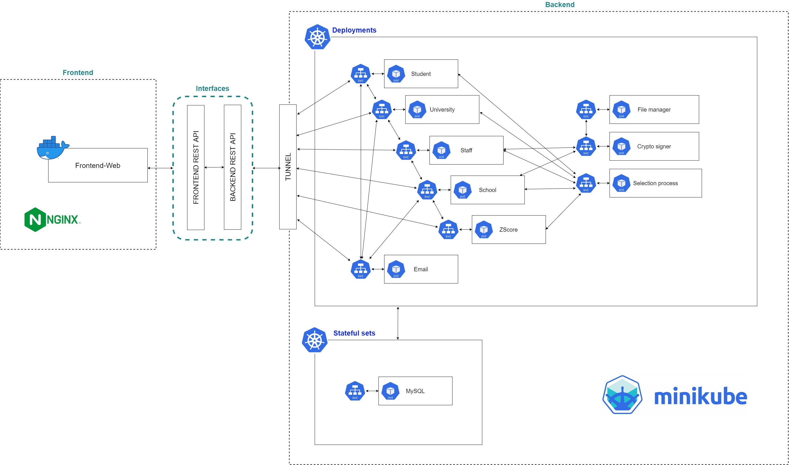

# 1. Prerequisites

Download and install following softwares before launching the project. Make sure after installing these softwares restart your computer.

- [Download IntelliJ IDEA Ultimate](https://www.jetbrains.com/idea/download/#section=windows)
- [Download VSCode](https://code.visualstudio.com/download)
- [Download MySQL for Windows Community](https://dev.mysql.com/downloads/installer/)
- [Download Java 18](https://www.oracle.com/java/technologies/downloads/#jdk18-windows)
- [Download Docker](https://www.docker.com/products/docker-desktop/)
- [Download Gitbash](https://git-scm.com/downloads)
- [Download Github Desktop](https://desktop.github.com/)
- [Download Postman](https://www.postman.com/downloads/)

After installing the above softwares, you can install following extensions in VSCode which makes your development easier

- ES7+ React/Redux/React-Native snippets
- Extension Pack for Java
- Prettier - Code formatter

# 2. Introduction

## How to use IntelliJ IDEA Ultimate ?

We are going to develop our backend using this. Open `backend-ms` folder using IntelliJ IDEA Ultimate and start coding. When you are opening the project make sure you have connected to internet as well.

## How to use VSCode?

Frontend is going to develop using this. Make sure you have installed above mention extentions as well. In order to run react using following stuffs,

- Open up the terminal inside VSCode by pressing `Ctrl + ~`
- When you startup with folder very first time you have to install node modules, therefore type `npm install`. Make sure you have connected to internet as well.
- Then in order to run react, type `npm start`

## How to use MySQL ?

Databases in the local machine is going to implement using MySQL. While you are installing MySQL give following credentials,

- `Username: root`
- `Password: root`
- Don't change rest of the settings. Keep them as it is.
- Before running the backend services execute `database_queries.sql` content inside MySQL (Just copy & paste the content and select all and click run)

## How to use Docker ?

In order to run several containers we use docker. If you go to backend-ms folder you can see `docker-compose.yml` file.

- Run it using CMD.
- Paste following command initally `docker-compose up -d`
- Now go to Docker application and Containers tab.
- You should see containers are running.
- You can open those by clicking the `Open with browser` button

## How to use Gitbash ?

In this project gitbash is only required for your initial Git credentials setups. In order to setup your github details, use following commands

- To setup username, `git config --global user.name "FIRST_NAME LAST_NAME"`
- To setup email, `git config --global user.email "MY_NAME@example.com"`
- To check your credetials, `git config --list`

## How to use Github Desktop ?

In order to version control we use Github Desktop. Once you download and install it, Sign in using following credentials,

- Github email: `ucscgroupproject@gmail.com`
- Github password: `Check our whatsapp group description`

Then go to the `ugc-project` repository and clone it to your device.

When you start implmentations, before start coding always `pull` the latest content using Github Desktop.

Then after you have finish coding always `push` your code.

Also DONT edit other services without asking from the relevant person of that particular service.

# 3. High level Architecture



# 4. Backend Architecture
Backend folder structure,

```
    backend-ms
    │   ├── student/                    PORT: 8081 # student service
    │   ├── university/                 PORT: 8082 # university service
    │   ├── staff/                      PORT: 8083 # staff service
    │   ├── school/                     PORT: 8084 # school service
    │   ├── eureka-server/              PORT: 8761 # central service for microservice management and inspection
    │   ├── email/                      PORT: 1000 # email sending
    │   ├── zscore/                     PORT: 1001 # z-score management
    │   ├── file-manager/               PORT: 1002 # to store and retrieve different types of files
    │   ├── crypto-signer/              PORT: 1003 # Sign PDF files
    │   └── selection-process/          PORT: 1004 # student selection process for university courses
    │
    ├── docker-compose.yml          # docker configurations
    └── pom.xml                     # global POM configurations
```

# 5. Frontend Architecture

[Content should be added]

# 6. Deployment Architecture



# 7. Resources

These are the tutorial and documentations that used to develop this project. It is extremely necessary to go through following resources at least once to get some hands on experience before moving to the actual project.

#### Youtube links

- [Core UI Admin dashboard](https://www.youtube.com/watch?v=L_NoBA7DRCI)
- [Amigoscode - Spring & Spring Boot](https://www.youtube.com/watch?v=8SGI_XS5OPw&list=PLwvrYc43l1MzeA2bBYQhCWr2gvWLs9A7S)
- [Amigoscode - Microservices](https://www.youtube.com/watch?v=p485kUNpPvE&list=PLwvrYc43l1Mwqpf9i-1B1gXfMeHOm6DeY)

#### Documentations

- [CoreUI - UI Component library](https://coreui.io/react/docs/getting-started/introduction/)
- [Spring Boot + React: JWT Authentication with Spring Security](https://www.bezkoder.com/spring-boot-react-jwt-auth/)

#### Github Repositories

- [Core UI template](https://github.com/coreui/coreui-free-react-admin-template)
- [amigoscode - Microservices](https://github.com/amigoscode/microservices)
- [bezkoder - Spring, Spring security & JWT auth (Backend part) ](https://github.com/bezkoder/spring-boot-spring-security-jwt-authentication)
- [bezkoder - React & JWT auth (Frontend part)](https://github.com/bezkoder/react-jwt-auth)
